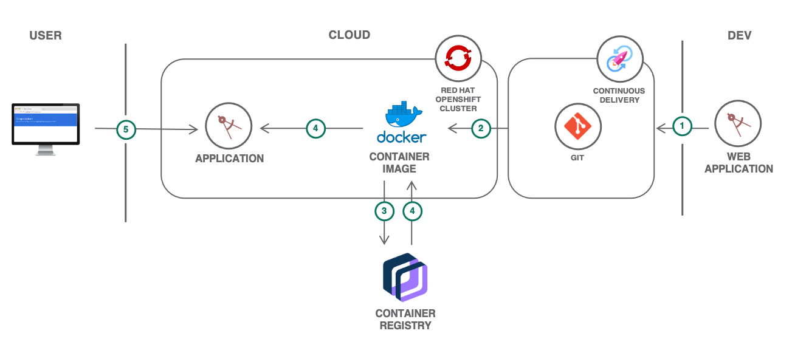

# OpenShift Node.js Starter

A production-ready **Node.js + Express** starter application designed to be built and deployed on **Red Hat OpenShift on IBM Cloud**. It ships with a Dockerfile, OpenShift build/deploy templates, helper scripts, Swagger API docs, health and load-test endpoints, and a clean folder structure you can use as a template for your own microservices.

> Companion code for the IBM Cloud solution tutorial: **Scalable web application on OpenShift**.

---

## Table of Contents

- [Features](#features)
- [Architecture](#architecture)
- [Project Structure](#project-structure)
- [Tech Stack](#tech-stack)
- [API Endpoints](#api-endpoints)
- [Prerequisites](#prerequisites)
- [Run Locally](#run-locally)
- [Run with Docker](#run-with-docker)
- [Deploy to OpenShift](#deploy-to-openshift)
  - [Option A: Public registry / public Git repo](#option-a-public-registry--public-git-repo)
  - [Option B: Private container registry](#option-b-private-container-registry)
  - [Option C: Private Git repository](#option-c-private-git-repository)
- [Environment Variables](#environment-variables)
- [Available npm Scripts](#available-npm-scripts)
- [Testing & Linting](#testing--linting)
- [Extending This Starter](#extending-this-starter)
- [Troubleshooting](#troubleshooting)
- [License](#license)
- [Author](#author)

---

## Features

- **Express 4** microservice with a clean `routes` / `controllers` separation.
- **Swagger UI** served at `/swagger/api-docs` for interactive API exploration.
- **Health endpoint** (`/health`) for liveness / readiness probes.
- **CPU load endpoint** (`/load/:iterations`) to demonstrate horizontal pod autoscaling on OpenShift.
- **Static landing page** served from `public/index.html` plus a custom **404** page.
- **Dockerfile** based on Red Hat UBI 8 for OpenShift-friendly container builds.
- **OpenShift template** (`openshift.template.yaml`) that provisions an **ImageStream**, **BuildConfig**, **DeploymentConfig**, and **Service** in one apply.
- **Helper script** (`generate_yaml.sh`) to render the template for either a private registry or a private Git repo.
- **Test, coverage, and lint tooling** preconfigured (Mocha, Chai, Sinon, Supertest, NYC, ESLint, Husky).

---

## Architecture



A high-level view of the deployment flow:

```
   GitHub  ──►  OpenShift BuildConfig  ──►  ImageStream  ──►  DeploymentConfig
                       (S2I / Docker)          (image)            (pods)
                                                                    │
                                                                    ▼
                                                                 Service ──► Route ──► Users
```

---

## Project Structure

```
openshift-nodejs-starter/
├── server/
│   ├── server.js                   # Express bootstrap, port binding, route mounting
│   ├── controllers/
│   │   ├── health-controller.js    # GET /health → { status: "UP" }
│   │   └── load-controller.js      # GET /load/:iterations → CPU work
│   ├── routes/
│   │   ├── health-route.js
│   │   ├── load-route.js
│   │   └── swagger-route.js
│   └── config/
│       └── swagger.json            # Swagger 2.0 spec served at /swagger/api-docs
├── public/
│   ├── index.html                  # Landing page
│   └── 404.html                    # Custom 404
├── images/
│   └── Architecture.png            # Architecture diagram
├── Dockerfile                      # UBI 8 based image
├── .dockerignore
├── .env.template                   # Template for local env vars used by generate_yaml.sh
├── openshift.template.yaml         # ImageStream + BuildConfig + DeploymentConfig + Service
├── generate_yaml.sh                # Renders openshift.template.yaml for your context
├── package.json
└── README.md
```

---

## Tech Stack

- **Runtime:** Node.js `>= 16`
- **Framework:** Express 4
- **API docs:** swagger-ui-express + Swagger 2.0 spec
- **Configuration:** `ibm-cloud-env` for environment-aware config
- **Tooling:** nodemon, ESLint, Husky
- **Testing:** Mocha, Chai, Sinon, Sinon-Chai, Supertest, NYC (Istanbul)
- **Container:** Red Hat UBI 8 (`registry.access.redhat.com/ubi8/ubi`)
- **Platform:** Red Hat OpenShift on IBM Cloud

---

## API Endpoints

| Method | Path                  | Description                                                        |
|--------|-----------------------|--------------------------------------------------------------------|
| GET    | `/`                   | Serves the landing page (`public/index.html`).                     |
| GET    | `/health`             | Returns `{ "status": "UP" }`. Use for liveness / readiness probes. |
| GET    | `/load/:iterations`   | Runs a CPU-bound prime calculation — useful for autoscaling demos. |
| GET    | `/swagger/api-docs`   | Interactive Swagger UI for the API.                                |
| `*`    | _unmatched_           | Returns the custom `public/404.html` page.                         |

Example:

```bash
curl http://localhost:3000/health
# {"status":"UP"}

curl http://localhost:3000/load/10000
```

---

## Prerequisites

- **Node.js 16+** and **npm**
- **Docker** (only if you want to build/run the container locally)
- **OpenShift CLI** (`oc`) and access to a Red Hat OpenShift on IBM Cloud cluster (only for deployment)
- A **container registry** (e.g. IBM Cloud Container Registry) where the built image will be pushed

---

## Run Locally

```bash
# 1. Clone
git clone https://github.com/ahmadimran-15/openshift-nodejs-starter.git
cd openshift-nodejs-starter

# 2. Install dependencies
npm install

# 3. Start the dev server (auto-reload via nodemon)
npm run dev

# or run the plain server
npm start
```

The app starts on **http://localhost:3000** by default (override with the `PORT` env var):

- App UI:        http://localhost:3000
- Health:        http://localhost:3000/health
- Swagger UI:    http://localhost:3000/swagger/api-docs
- Load demo:     http://localhost:3000/load/10000

---

## Run with Docker

```bash
# Build the image
docker build -t openshift-nodejs-starter:latest .

# Run it (the Dockerfile exposes port 8080)
docker run --rm -p 8080:8080 openshift-nodejs-starter:latest
```

Then open http://localhost:8080.

> The provided `Dockerfile` is based on Red Hat UBI 8 so it builds and runs cleanly inside OpenShift's restricted security contexts.

---

## Deploy to OpenShift

The repository ships with `openshift.template.yaml`, which defines four objects in one list:

1. **ImageStream** — tracks the application image in your registry.
2. **BuildConfig** — builds the image from your Git repo using the Docker strategy and pushes it to your registry.
3. **DeploymentConfig** — deploys the image with `replicas: 1` on container port `3000`.
4. **Service** — exposes port `3000` inside the cluster.

The `generate_yaml.sh` script substitutes your environment variables into the template and writes a deploy-ready file. Start by copying the template:

```bash
cp .env.template .env
# edit .env and fill in the values, then:
source .env
```

`.env.template` defines:

```
export MYPROJECT=<USERNAME>-openshiftapp
export MYREGISTRY=
export MYNAMESPACE=
export GIT_TOKEN_USERNAME=
export GIT_TOKEN_PASSWORD=
export REPO_URL_WITHOUT_HTTPS=
```

### Option A: Public registry / public Git repo

You can apply `openshift.template.yaml` directly after substituting the variables yourself, e.g.:

```bash
envsubst < openshift.template.yaml | oc apply -f -
oc start-build $MYPROJECT --follow
oc expose svc/$MYPROJECT
```

### Option B: Private container registry

```bash
chmod +x generate_yaml.sh
./generate_yaml.sh use_private_registry
oc apply -f openshift_private_registry.yaml
```

This appends `-priv-reg` to your project name and references a `push-secret` for pushing the image to your private registry. Make sure that secret exists in the namespace before applying:

```bash
oc create secret docker-registry push-secret \
  --docker-server=$MYREGISTRY \
  --docker-username=<user> \
  --docker-password=<password>
```

### Option C: Private Git repository

```bash
chmod +x generate_yaml.sh
./generate_yaml.sh use_private_repository
oc apply -f openshift_private_repository.yaml
```

This builds an authenticated Git URL using `GIT_TOKEN_USERNAME` and `GIT_TOKEN_PASSWORD` against `REPO_URL` and writes `openshift_private_repository.yaml`.

After applying, kick off a build and expose the service via a route:

```bash
oc start-build $MYPROJECT --follow
oc expose svc/$MYPROJECT
oc get route $MYPROJECT
```

---

## Environment Variables

| Variable                  | Where it's used                  | Description                                                  |
|---------------------------|----------------------------------|--------------------------------------------------------------|
| `PORT`                    | `server/server.js`               | Port the Express server listens on (defaults to `3000`).     |
| `NODE_ENV`                | `Dockerfile`                     | Set to `production` in the container image.                  |
| `MYPROJECT`               | `generate_yaml.sh`               | OpenShift app name (becomes ImageStream/BC/DC/Service name). |
| `MYREGISTRY`              | `generate_yaml.sh` / template    | Container registry hostname (e.g. `us.icr.io`).              |
| `MYNAMESPACE`             | `generate_yaml.sh` / template    | Registry namespace where the image will live.                |
| `GIT_TOKEN_USERNAME`      | `generate_yaml.sh`               | Username for private Git auth.                               |
| `GIT_TOKEN_PASSWORD`      | `generate_yaml.sh`               | Token / password for private Git auth.                       |
| `REPO_URL_WITHOUT_HTTPS`  | `generate_yaml.sh`               | Private repo URL without the `https://` prefix.              |

---

## Available npm Scripts

| Script                  | What it does                                                  |
|-------------------------|---------------------------------------------------------------|
| `npm start`             | Starts the server with `node server/server.js`.               |
| `npm run dev`           | Starts the server with `nodemon` for auto-reload.             |
| `npm test`              | Runs the Mocha test suite under NYC for coverage.             |
| `npm run check-coverage`| Fails if line coverage drops below 100%.                      |
| `npm run lint`          | Runs ESLint over the project.                                 |
| `npm run fix`           | Runs ESLint with `--fix` to auto-fix issues.                  |

---

## Testing & Linting

```bash
# Run all tests under server/ + collect coverage in coverage/
npm test

# Enforce 100% line coverage
npm run check-coverage

# Lint
npm run lint
npm run fix
```

Husky is wired in via `devDependencies` and can be configured to run lint/tests on `pre-commit`.

---

## Extending This Starter

- **Add a new endpoint:** create a controller in `server/controllers/`, a router in `server/routes/`, and mount it in `server/server.js`.
- **Document it in Swagger:** extend `server/config/swagger.json` with the new path and definitions — it will appear automatically at `/swagger/api-docs`.
- **Wire in IBM Cloud services:** use `ibm-cloud-env` to read mappings (Cloud Foundry, Kubernetes secrets, local dev JSON) in a single, environment-aware way.
- **Autoscale on OpenShift:** add an `HorizontalPodAutoscaler` against the `DeploymentConfig` and use `/load/:iterations` to drive CPU usage during testing.

---

## Troubleshooting

| Symptom | Likely cause / fix |
|---|---|
| `oc apply` fails with `secret "push-secret" not found` | Create the registry pull/push secret before applying the BuildConfig. |
| Build succeeds but pods stay in `ImagePullBackOff` | Check that the DeploymentConfig and ImageStream point to the same `MYREGISTRY/$MYNAMESPACE/$MYPROJECT:latest`. |
| Health check fails on OpenShift | Ensure the readiness probe targets port `3000` (the container port the app listens on). |
| Swagger UI is blank | Confirm `swagger-ui-express` is installed and `server/config/swagger.json` is valid JSON. |
| `generate_yaml.sh: command not found` | Make it executable: `chmod +x generate_yaml.sh`. |
| Port already in use locally | Set a different port: `PORT=4000 npm start`. |

---

## License

Licensed under the **Apache License 2.0** — see the [LICENSE](LICENSE) file for the full text.

---

## Author

**Ahmad Imran**  
GitHub: [@ahmadimran-15](https://github.com/ahmadimran-15)

If this starter saves you time, please consider giving the repository a ⭐ on GitHub.
